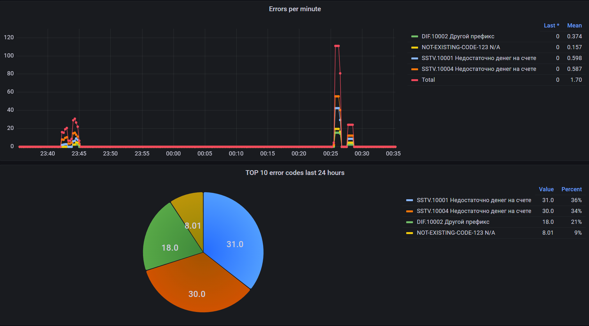
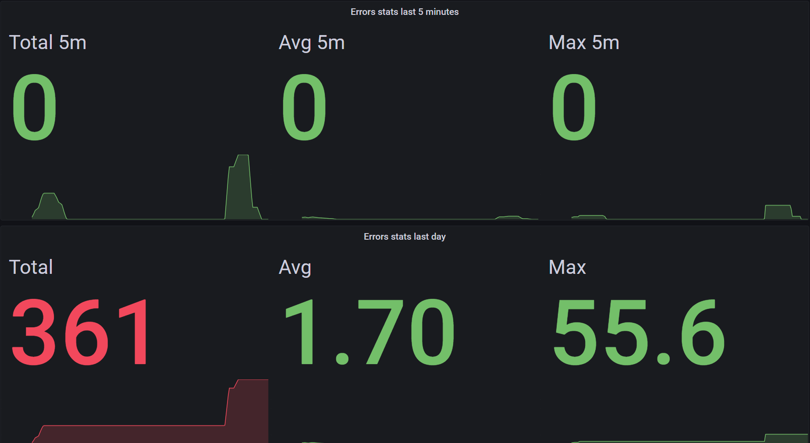

Sstv.DomainExceptions.Extensions.DependencyInjection
=============

[<- root readme](./../README.md)

[<- changelog](./CHANGELOG.md)

This library brings to Sstv.DomainExceptions additional capabilities to register some cool services to dependency injection container.

## Install

You can install using Nuget Package Manager:

```bash
Install-Package Sstv.DomainExceptions.Extensions.DependencyInjection -Version 2.2.0
```

via the .NET CLI:

```bash
dotnet add package Sstv.DomainExceptions.Extensions.DependencyInjection --version 2.2.0
```

or you can add package reference manually:

```xml
<PackageReference Include="Sstv.DomainExceptions.Extensions.DependencyInjection" Version="2.2.0" />
```

## How to use?

### Register to Dependency injection:
Call `AddDomainExceptions` extension method on IServiceCollection,
and optionally configure it's behaviour:

```csharp
services.AddDomainExceptions();
```

### Configure settings:
```csharp
services.AddDomainExceptions(builder =>
{
    builder.ConfigureSettings = (sp, settings) =>
    {
        settings.GenerateExceptionIdAutomatically = true;      // true by default
        settings.CollectErrorCodesMetricAutomatically = true;  // true by default
        settings.ThrowIfHasNoErrorCodeDescription = true;      // true by default

        // manually provide you own singleton implementation of IErrorCodesDescriptionSource
        settings.ErrorCodesDescriptionSource = new MyAwesomeSource();

        // override default error description
        settings.DefaultErrorDescriptionProvider = 
            errorCode => new ErrorDescription(errorCode, "N/A");
    };
});
```

### Choose IErrorCodesDescriptionSource:
If you use constants over enums, you can choose how to provide error codes description:

```csharp
services.AddDomainExceptions(bulder =>
{
    // register your own implementation of IErrorCodesDescriptionSource as Singleton
    bulder.WithErrorCodesDescriptionSource<MyAwesomeSource>();
    
    // or you can pass in memory dictionary
    bulder.WithErrorCodesDescriptionFromMemory(new Dictionary<string, ErrorDescription>
    {
        ["SSTV.10004"] = new("SSTV.10004", "Some error description", "https://help.myproject.ru/error-codes/not-enough-money"),
        ["SSTV.10005"] = new("SSTV.10005", "Another error", "https://help.myproject.ru/error-codes/SSTV.10005"),
        ["SSTV.10006"] = new("SSTV.10006", "One more error", "https://help.myproject.ru/error-codes/SSTV.10006"),
    });

    // or load from appsettings.json, and optionally set configuration section name.
    bulder.WithErrorCodesDescriptionFromConfiguration();
});
```

All this sources internally merged and can be used by any DomainException class


Below example of appsettings.json, if you choose `WithErrorCodesDescriptionFromConfiguration` with default configuration section
`DomainExceptionSettings:ErrorCodes`:

```json
{
  "DomainExceptionSettings": {
    "ErrorCodes": {
      "SSTV.10004": {
        "Description": "You have not enough money",
        "HelpLink": "https://help.myproject.ru/error-codes/not-enough-money"
      },
      "SSTV.10005": {
        "Description": "This is an obsolete error code from appsettings.json",
        "IsObsolete": true
      }
    }
  }
}
```

if you don't choose any of ErrorCodesDescription, `WithErrorCodesDescriptionFromConfiguration` is would be set by default, so you can just add to DI and go and fill the appsettings! :)
```csharp
services.AddDomainExceptions();
```

### Metric collection using OpenTelemetry

Sstv.DomainException expose public class `ErrorCodesMeter` with method `Measure`,
which called every time, when DomainException instantiated, and counts errors occured with OpenTelemetry counter metric:

```
error_codes_total { code="SSTV.10004", message="You have not enough money" }
```

This library have an extension method `AddDomainExceptionInstrumentation`, that can be called on `MeterProviderBuilder` to start collecting this metric.
```diff
builder.Services.AddOpenTelemetry()
    .ConfigureResource(b => b.AddService(serviceName: "MyService"))
    .WithMetrics(mp =>
    {
+       mp.AddDomainExceptionInstrumentation();
        mp.AddAspNetCoreInstrumentation();
        mp.AddPrometheusExporter();
    });
```

this metrics can be visualized in [Grafana dashboard](./../dev/grafana/dashboards/GrafanaDashboard.json) like this:



Prometheus queries:
```pql
// errors by code and message
sum(increase(error_codes_total[1m])) by (code, message)

// total
sum(increase(error_codes_total[1m]))
```



Prometheus queries:
```pql
// TOP 10 error codes last 24 hours
topk(10, sum(increase(error_codes_total[24h])) by (code, message))

// Errors stats last 5 minutes
sum_over_time(sum(increase(error_codes_total[1m]))[5m:])
avg_over_time(sum(increase(error_codes_total[1m]))[5m:])
max_over_time(sum(increase(error_codes_total[1m]))[5m:])

// Errors stats last day
sum_over_time(sum(increase(error_codes_total[1m]))[1d:])
avg_over_time(sum(increase(error_codes_total[1m]))[1d:])
max_over_time(sum(increase(error_codes_total[1m]))[1d:])
```

### Debug error codes middleware

Sometimes we want to see all the error codes in application, how they are configured, where they came from, is all description was correctly pulled from configuration on enum attribute and so on.
For this purpose, you can call `UseErrorCodesDebugView` on `DomainExceptionBuilder`

```csharp
services.AddDomainExceptions(builder =>
{
    // in this example used default values
    builder.UseErrorCodesDebugView("/error-codes", port: 8082);
});
```

```csharp
// you can also add to middleware pipeline via IApplicationBuilder
app.UseErrorCodesDebugView();
```

output example:

```json
// http://localhost:5115/error-codes
{
  "errorCodes": [
    {
      "code": "SSTV.10001",
      "helpLink": "https://help.myproject.ru/error-codes/not-enough-money",
      "message": "You have not enough money"
    },
    {
      "code": "DIF.10003",
      "helpLink": "https://help.myproject.ru/error-codes/DIF.10003",
      "message": "Obsolete error code in enum",
      "isObsolete": true
    },
    {
      "code": "SSTV.10004",
      "helpLink": "https://help.myproject.ru/error-codes/not-enough-money",
      "message": "You have not enough money"
    },
    {
      "code": "SSTV.10005",
      "message": "This is an obsolete error code from appsettings.json",
      "isObsolete": true
    }
  ]
}
```

also, if you want to enrich this output, you should implement `IDomainExceptionDebugEnricher` and register it to dependency injection container
and extend `AdditionalData` dictionary property with your data.